# Database Schema - Mermaid ER Diagram

This document contains the complete Entity Relationship diagram for the wallet2cointracking database schema, including both the Flask application models and the ETL data warehouse schema.

## Complete Database Schema ER Diagram

```mermaid
erDiagram
    %% ===========================================
    %% FLASK APPLICATION MODELS (Main Schema)
    %% ===========================================
    
    ETHEREUM_TRANSACTIONS {
        integer id PK
        integer chain_id
        string tx_hash UK
        bigint block_number
        datetime block_time
        string from_address
        string to_address
        numeric value
        bigint gas_used
        bigint gas_price
        integer status
        text input_data
        json logs
        string protocol
        string action_type
        datetime processed_at
    }
    
    TOKEN_TRANSFERS {
        integer id PK
        integer chain_id
        string tx_hash
        integer log_index
        bigint block_number
        datetime block_time
        string token_address
        string from_address
        string to_address
        numeric value_raw
        numeric value_scaled
        string token_symbol
        string token_name
        integer token_decimals
        numeric usd_value
        string protocol
        datetime processed_at
    }
    
    WALLET_ANALYSIS {
        integer id PK
        string wallet_address
        integer chain_id
        datetime analysis_date
        integer total_transactions
        integer defi_transactions
        numeric total_volume_usd
        json protocols_used
        json token_portfolio
        numeric risk_score
        datetime last_activity
    }
    
    %% ===========================================
    %% ETL DATA WAREHOUSE - CORE SCHEMA
    %% ===========================================
    
    %% Core Dimensions
    DIM_CHAIN {
        integer chain_id PK
        text chain_name
        text native_symbol
        text explorer_url
        timestamptz created_at
    }
    
    DIM_TOKEN {
        integer chain_id PK
        text token_address PK
        text symbol
        text name
        integer decimals
        boolean is_stablecoin
    }
    
    CONTRACTS {
        integer chain_id PK
        text address PK
        text protocol
        text component
        text version
        bigint start_block
        bigint end_block
        jsonb meta
    }
    
    BLOCKS {
        integer chain_id PK
        bigint block_number PK
        text block_hash
        timestamptz block_time
        text parent_hash
    }
    
    %% ===========================================
    %% PROTOCOL SPECIFIC TABLES
    %% ===========================================
    
    %% OpenOcean Protocol
    OPENOCEAN_SWAPS {
        integer chain_id PK
        bigint block_number PK
        text tx_hash PK
        integer log_index PK
        timestamptz block_time
        text aggregator_addr
        text user_addr
        text src_token
        text dst_token
        numeric amount_in_raw
        numeric amount_out_raw
        numeric amount_in
        numeric amount_out
        integer slippage_bps
        numeric fee_amount_raw
        text fee_token
        text recipient
        text route_id
    }
    
    OPENOCEAN_ROUTE_LEGS {
        integer chain_id PK
        bigint block_number PK
        text tx_hash PK
        integer parent_log_index PK
        integer seq PK
        text dex_name
        text pool_address
        text token_in
        text token_out
        numeric amount_in_raw
        numeric amount_out_raw
        numeric amount_in
        numeric amount_out
        integer fee_bps
    }
    
    %% SparkDEX v3 Protocol
    SPARKDEX_V3_POOLS {
        integer chain_id PK
        text pool_address PK
        text token0
        text token1
        integer fee_tier
        integer tick_spacing
        bigint created_block
    }
    
    SPARKDEX_V3_SWAPS {
        integer chain_id PK
        bigint block_number PK
        text tx_hash PK
        integer log_index PK
        timestamptz block_time
        text pool_address
        text sender
        text recipient
        numeric amount0
        numeric amount1
        numeric sqrt_price_x96
        numeric liquidity
        integer tick_after
    }
    
    SPARKDEX_V3_LIQUIDITY {
        integer chain_id PK
        bigint block_number PK
        text tx_hash PK
        integer log_index PK
        timestamptz block_time
        text pool_address
        text owner
        text event_type
        integer tick_lower
        integer tick_upper
        numeric liquidity_delta
        numeric amount0
        numeric amount1
        numeric fees0
        numeric fees1
    }
    
    %% Aave v3 Protocol
    AAVE_V3_RESERVE_INDICES {
        integer chain_id PK
        bigint block_number PK
        text reserve_address PK
        timestamptz block_time
        numeric liquidity_index_ray
        numeric variable_borrow_index_ray
        numeric liquidity_rate_ray
        numeric variable_borrow_rate_ray
    }
    
    AAVE_V3_EVENTS {
        integer chain_id PK
        bigint block_number PK
        text tx_hash PK
        integer log_index PK
        timestamptz block_time
        text event_type
        text user_address
        text reserve_address
        numeric amount_raw
        numeric amount
        text interest_rate_mode
        numeric debt_to_cover_raw
        text collateral_asset
        text liquidator
    }
    
    %% Kinetic Protocol (Flare Lending)
    KINETIC_EVENTS {
        integer chain_id PK
        bigint block_number PK
        text tx_hash PK
        integer log_index PK
        timestamptz block_time
        text event_type
        text user_address
        text reserve_address
        numeric amount_raw
        numeric amount
        text liquidator
        text collateral_asset
    }
    
    %% PancakeSwap Protocol
    PANCAKESWAP_PAIRS {
        integer chain_id PK
        text pair_address PK
        text token0
        text token1
        bigint created_block
    }
    
    PANCAKESWAP_SWAPS {
        integer chain_id PK
        bigint block_number PK
        text tx_hash PK
        integer log_index PK
        timestamptz block_time
        text pair_address
        text sender
        text to_address
        numeric amount0_in
        numeric amount1_in
        numeric amount0_out
        numeric amount1_out
    }
    
    PANCAKESWAP_LIQUIDITY {
        integer chain_id PK
        bigint block_number PK
        text tx_hash PK
        integer log_index PK
        timestamptz block_time
        text pair_address
        text event_type
        numeric amount0
        numeric amount1
        text to_from
    }
    
    PANCAKESWAP_SYNCS {
        integer chain_id PK
        bigint block_number PK
        text tx_hash PK
        integer log_index PK
        timestamptz block_time
        text pair_address
        numeric reserve0
        numeric reserve1
    }
    
    %% Flare FTSO Protocol
    FLARE_FTSO_FEEDS {
        text feed_id_hex PK
        text name
        text category
        text risk_level
        integer decimals_hint
    }
    
    FLARE_FTSO_FEED_VALUES {
        integer chain_id PK
        bigint block_number PK
        text feed_id_hex PK
        timestamptz block_time
        numeric value
        numeric raw_value_wei
    }
    
    %% ===========================================
    %% RELATIONSHIPS
    %% ===========================================
    
    %% Core Dimension Relationships
    DIM_TOKEN ||--o{ DIM_CHAIN : "belongs_to"
    CONTRACTS ||--o{ DIM_CHAIN : "deployed_on"
    BLOCKS ||--o{ DIM_CHAIN : "belongs_to"
    
    %% Flask Models to Core Dimensions
    ETHEREUM_TRANSACTIONS ||--o{ DIM_CHAIN : "executed_on"
    TOKEN_TRANSFERS ||--o{ DIM_CHAIN : "executed_on"
    WALLET_ANALYSIS ||--o{ DIM_CHAIN : "analyzed_on"
    
    %% Protocol Tables to Core Dimensions
    OPENOCEAN_SWAPS ||--o{ DIM_CHAIN : "executed_on"
    OPENOCEAN_SWAPS ||--o{ BLOCKS : "included_in"
    OPENOCEAN_ROUTE_LEGS ||--o{ OPENOCEAN_SWAPS : "part_of"
    
    SPARKDEX_V3_POOLS ||--o{ DIM_CHAIN : "deployed_on"
    SPARKDEX_V3_SWAPS ||--o{ DIM_CHAIN : "executed_on"
    SPARKDEX_V3_SWAPS ||--o{ SPARKDEX_V3_POOLS : "traded_in"
    SPARKDEX_V3_LIQUIDITY ||--o{ DIM_CHAIN : "executed_on"
    SPARKDEX_V3_LIQUIDITY ||--o{ SPARKDEX_V3_POOLS : "provided_to"
    
    AAVE_V3_RESERVE_INDICES ||--o{ DIM_CHAIN : "tracked_on"
    AAVE_V3_EVENTS ||--o{ DIM_CHAIN : "executed_on"
    
    KINETIC_EVENTS ||--o{ DIM_CHAIN : "executed_on"
    
    PANCAKESWAP_PAIRS ||--o{ DIM_CHAIN : "deployed_on"
    PANCAKESWAP_SWAPS ||--o{ DIM_CHAIN : "executed_on"
    PANCAKESWAP_SWAPS ||--o{ PANCAKESWAP_PAIRS : "traded_in"
    PANCAKESWAP_LIQUIDITY ||--o{ DIM_CHAIN : "executed_on"
    PANCAKESWAP_LIQUIDITY ||--o{ PANCAKESWAP_PAIRS : "provided_to"
    PANCAKESWAP_SYNCS ||--o{ DIM_CHAIN : "executed_on"
    PANCAKESWAP_SYNCS ||--o{ PANCAKESWAP_PAIRS : "synced_for"
    
    FLARE_FTSO_FEED_VALUES ||--o{ DIM_CHAIN : "reported_on"
    FLARE_FTSO_FEED_VALUES ||--o{ FLARE_FTSO_FEEDS : "value_of"
```

## Schema Layer Description

### Flask Application Layer (Main Schema)
- **ethereum_transactions**: Core transaction records processed by the Flask app
- **token_transfers**: ERC-20 token transfer events with USD valuations
- **wallet_analysis**: Aggregated wallet analytics and risk scoring

### ETL Data Warehouse Layer (Core Schema)

#### Core Dimensions
- **dim_chain**: Blockchain network definitions (Ethereum, Arbitrum, Flare, BSC)
- **dim_token**: Token metadata with decimals and stablecoin flags
- **contracts**: Smart contract registry with protocol classification
- **blocks**: Block-level metadata for all chains

#### Protocol-Specific Tables

**OpenOcean DEX Aggregator**
- Multi-hop swap routing with detailed execution logs
- Route leg breakdown for complex transactions

**SparkDEX v3 (Uniswap v3 Clone)**
- Concentrated liquidity pools with tick-based pricing
- Swap events with sqrt pricing and liquidity tracking
- Liquidity provision/removal events

**Aave v3 Lending Protocol**
- Interest rate indices for lending calculations
- Supply, withdraw, borrow, repay, and liquidation events

**Kinetic Market (Flare Lending)**
- Flare network-specific lending protocol events
- Similar to Aave but optimized for Flare ecosystem

**PancakeSwap v2**
- AMM pair-based trading with constant product formula
- Liquidity mining and sync events

**Flare FTSO (Oracle System)**
- Price feed definitions with risk classifications
- Time-series price data from Flare's native oracle network

## Key Design Patterns

1. **Multi-Chain Support**: All protocol tables include `chain_id` for cross-chain analytics
2. **Raw + Scaled Values**: Financial amounts stored in both raw wei/units and scaled decimal format
3. **Event Sourcing**: All protocol interactions stored as immutable event logs
4. **Time-Series Ready**: Block time indexing for temporal analysis
5. **Composite Primary Keys**: Chain + block + transaction + log_index for uniqueness
6. **JSON Flexibility**: Metadata and complex objects stored as JSON/JSONB

## Usage Notes

- The Flask application models (`ethereum_transactions`, `token_transfers`, `wallet_analysis`) serve as the primary API interface
- The ETL core schema provides detailed protocol-specific analytics
- All tables are designed for high-volume DeFi transaction processing
- Cross-references between layers enable comprehensive wallet and protocol analysis