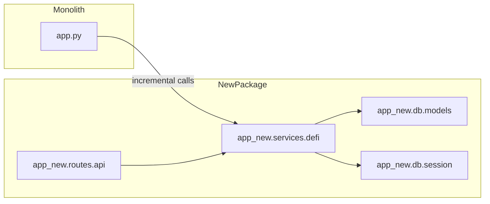
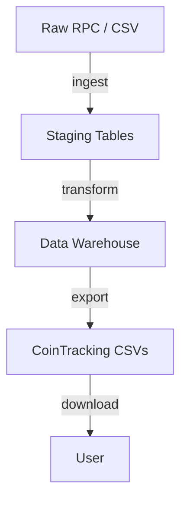

## Module boundaries

```mermaid
flowchart LR
  subgraph Monolith
    A[app.py]
  end
  subgraph NewPackage
    B[app_new.services.defi]
    C[app_new.db.models]
    D[app_new.db.session]
    E[app_new.routes.api]
  end
  A -->|incremental calls| B
  B --> C
  B --> D
  E --> B
```

## ETL flow

```mermaid
flowchart TD
  RawData[Raw RPC / CSV] -->|ingest| Staging[Staging Tables]
  Staging -->|transform| Warehouse[Data Warehouse]
  Warehouse -->|export| CSVs[CoinTracking CSVs]
  CSVs -->|download| User
```
